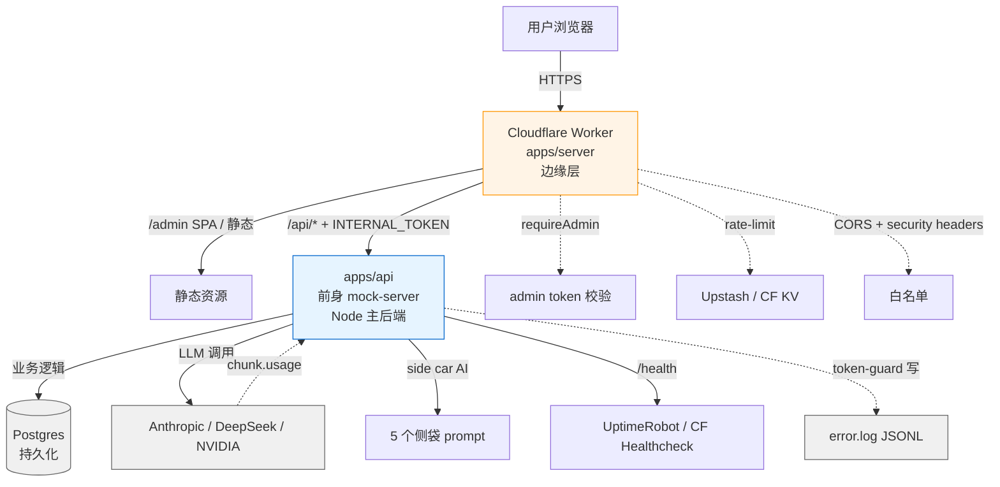

# Sprint：灰测窗口 Leftovers（2026-05-14）

> **窗口**：灰测开测当周（与 Phase 2 启动会议并行）
> **目标**：把 Sprint Phase 1 验收时浮出的 5 项小事 + 1 个会议一次性扫掉
> **前置**：[Sprint Phase 1](2026-05-14-gray-window.md) 已合入主线
> **总入场命令**：`pnpm verify:gray`（全绿才能合）

---

## 工单概览

| ID | 标题 | 优先级 | 预算 | 负责人 |
|---|---|---|---|---|
| **MEET-INT-TOKEN** | INTERNAL_TOKEN 启动会（4 决策点） | P0 | 30 min | 架构 + PM + 你 |
| **FE-120** | useChat 消息状态改 ref/store | P0 | 半天 | 前端 |
| **AD-107** | 移除 Admin 默认 token fallback | P0 | 5-30 min | 前端 |
| **OPT-CHAT-CUTOFF-REQID** | chat.ts:71 quota cutoff writeEv 注 requestId | P3 | 5 min | 任意（谁路过 chat.ts 顺手） |
| **DOC-102** | 顶层架构图（mermaid） | P2 | 1-2 h | 架构 |
| **INFRA-101-CRON** | state.json 自动备份 cron | P2 | 1-1.5 h | 运维 |

**合并建议**：FE-120 + AD-107 + OPT-CHAT-CUTOFF-REQID 可合一个 PR `chore/gray-window-leftovers`（一个前端半天搞定）。DOC-102 和 INFRA-101-CRON 独立。

---

## MEET-INT-TOKEN — INTERNAL_TOKEN 启动会

**优先级**：P0 | **预算**：30 min | **形式**：会议，非代码

### 背景（给主管的比喻）

我们决定要在国外开分店（边缘层 Worker），分店和总店（Node 后端）之间要用快递互寄文件。**这个会决定快递袋子上的封条用什么格式、钥匙放哪、丢了怎么补**。不开会，快递员不能上路，分店开不了门——Phase 2 的 9 个工单全部停在原地。

### Agenda（4 个决策点）

#### 1. INTERNAL_TOKEN 怎么生成

| 选项 | 好处 | 代价 |
|---|---|---|
| **随机 256-bit hex**（推荐） | 最简单；改一次值=轮转一次 | 不能验证签发者 |
| HMAC-SHA256 签名 | 可带 issued-at / exp | 实现复杂 5 行 |
| JWT (HS256) | 标准；可带 claims | 引入 JWT 库 |

#### 2. 存哪

| 选项 | 适用 |
|---|---|
| **Cloudflare Workers Secrets**（推荐） | 边缘端 |
| Docker compose env_file | Node 端 |
| 同一 token 通过 CI 注入到两端 | 二者保持一致最稳 |

#### 3. 轮转策略

| 选项 | 好处 | 代价 |
|---|---|---|
| 手动按需 | 灰测足够 | 容易忘 |
| **定期 90 天**（推荐） | 习惯化 | 定期工 |
| 双 token 重叠期 | 零停机 | 实现成本高 |

#### 4. 泄露应急

- 发现泄露 → 多久能轮转完成？目标：**1 小时内**
- 谁有权限改 secrets？至少 2 人
- 是否记录 token 使用日志（便于事后审计）？

### 输出物

- 决议 1-2 页落到 `docs/tech/adr/0009-internal-token-design.md`
- 会后我（架构/Claude）写 Phase 2 全套 9 个工单到 `docs/sprint/2026-05-XX-edge-layer.md`

---

## FE-120 — useChat 消息状态改 ref/store

**优先级**：P0 | **预算**：半天

### 背景（比喻）

现在前端聊天框就像收银员只有**一张铅笔便签纸**记所有顾客订单——平时没事，但 3 个顾客同时喊单时就开始涂改、写错位置、漏单。改成**每个顾客一张独立小票**（ref / store）就稳了。灰测期间用户快速发送多条消息（"在吗？""你好""刚才回什么"）容易复现这个问题。

### 改什么

`apps/web/src/scenes/Conversation.tsx` 里的 `useChat` 当前用 React `useState<ChatMessage[]>` + `send` 闭包依赖 `messages`，且 `send` 内部 setState 修改 `messages`——典型的"闭包看到旧值"陷阱。

改造方向（择一）：
1. **改 ref + forceUpdate**（最小侵入）：用 `useRef<ChatMessage[]>` 存消息，UI 渲染靠 `useState<number>` 自增触发重渲染
2. **改 zustand store**（推荐）：建 `chatStore` 集中管理消息列表，`send` 不依赖 React 闭包
3. **改 useReducer**（折中）：reducer 模式天然没闭包问题

### 验收

```bash
pnpm verify:gray  # 全绿

# 单测：apps/web/src/scenes/__tests__/useChat.test.ts
# - 快速连发 5 条消息，最终 messages 数组顺序正确
# - send 调用期间不读 stale messages
# - cutoff 事件后不再追加新消息

# 手测：本地起 web，连续敲 5 次发送（不等 SSE 完成）
# 期望：5 条用户消息按顺序出现，SSE 5 个回复也按顺序进入对应位置
```

### PR

- **分支**：`refactor/fe-120-usechat-ref-store`
- **标题**：`refactor(web): move useChat messages from state to ref/store (FE-120)`

### 关联

- TODOlist FE-120
- 接口审计与TODO.md §五"被忽视的旧 P0"

---

## AD-107 — 移除 Admin 默认 token fallback

**优先级**：P0 | **预算**：5 分钟看代码，至多 30 分钟修

### 背景（比喻）

管理后台的密码字段，**如果运维忘了填，会偷偷 fallback 到代码里写死的 `admin-dev-token`**。这就像保险柜出厂带一把"经销商通用钥匙"——本地开发用没事，但灰测部署时如果有人忘改，全网都能拿这把钥匙开柜。

### 改什么

**1. 检查**：

```bash
grep -rn "admin-dev-token" apps/admin/src/
grep -rn "|| 'admin-dev-token'" apps/admin/
grep -rn "fallback\|default" apps/admin/src/api/
```

预期发现 `apps/admin/src/api/client.ts` 有类似：

```ts
const ADMIN_TOKEN = import.meta.env.VITE_ADMIN_TOKEN || 'admin-dev-token';
```

**2. 修**：

```ts
const ADMIN_TOKEN = import.meta.env.VITE_ADMIN_TOKEN;
if (!ADMIN_TOKEN) {
  console.warn('[admin] VITE_ADMIN_TOKEN not set — admin console will get 401 from all endpoints');
}
```

或者更严格：开发态保留默认值但生产构建强制要求（`import.meta.env.PROD`）。

### 验收

```bash
pnpm verify:gray  # 全绿

# 手测
unset VITE_ADMIN_TOKEN
pnpm --filter "./apps/admin" run dev
# 打开 admin 控制台 → 任何 API 调用应 401（而不是因为 fallback 通过）
```

### PR

- 与 FE-120 合 `chore/gray-window-leftovers`

### 关联

- TODOlist AD-107
- mock-server 已有 `ALLOW_DEFAULT_ADMIN_TOKEN` 守门（DEPLOY_MODE=server 时拒绝），这次是前端侧补齐

---

## OPT-CHAT-CUTOFF-REQID — chat.ts:71 顺手项

**优先级**：P3 | **预算**：5 分钟

### 背景

SSE 流有 3 条出口路径：正常回答 / 限额拦截 / 对话结束。前两条都贴了 requestId 标签（出事能追到日志），**限额拦截这条独立闭包没贴**。99% 用户不会走这条，但万一灰测期间触发，运维追不到。

我已经在 Phase 1 验收两次 flag 过这条，开发说"下个 sprint 顺手做"，这就是。

### 改什么

`apps/mock-server/src/routes/chat.ts` line 69-71 当前：

```ts
const writeEv = (ev: ChatStreamEvent) =>
  stream.writeSSE({ data: JSON.stringify(ev) });
await writeEv({ kind: 'cutoff', reason: 'quota' });
```

改成（与 line 199-201 的主路径一致）：

```ts
const requestId = (c.get('requestId') as string) || `req_${randomUUID().slice(0, 12)}`;
const writeEv = (ev: ChatStreamEvent) =>
  stream.writeSSE({ data: JSON.stringify({ ...ev, requestId }) });
await writeEv({ kind: 'cutoff', reason: 'quota' });
```

### 验收

```bash
pnpm verify:gray  # 全绿

# 加 1 个测试到 gray.test.ts：
# 触发 quota cutoff（让用户配额耗尽）→ SSE cutoff event 含 requestId
```

### PR

- 与 FE-120 合 `chore/gray-window-leftovers`

---

## DOC-102 — 顶层架构图（mermaid）

**优先级**：P2 | **预算**：1-2 h

### 背景（比喻）

ADR-0008 拍板了"我们要盖什么楼"，但只有文字描述，下个 sprint 进来的新人或外包要花 1 小时看文档才能理解架构。一张 mermaid 图把"用户 → Worker → mock-server → DB"画清楚，新人 5 秒看懂。

### 改什么

新建 `docs/architecture/topology.md`，画一张反映 ADR-0008 方案 A 目标形态的 mermaid 图：



加几段说明：
- 各层职责（who does what）
- requestId 流转路径（用户请求 → 边缘生成 → 透传到 Node → 写入 error.log）
- INTERNAL_TOKEN 守门（边缘签 → Node 验签）
- 数据持久化：state.json（开发态）vs Postgres（生产）

### 验收

- 在 GitHub Preview / VS Code 能正确渲染
- README 文档索引加上 `docs/architecture/topology.md` 链接

### PR

- **分支**：`docs/doc-102-topology-diagram`
- **标题**：`docs(architecture): add ADR-0008 topology diagram (DOC-102)`

---

## INFRA-101-CRON — state.json 自动备份

**优先级**：P2 | **预算**：1-1.5 h

### 背景（比喻）

`gray:snapshot` 像游戏里的手动存档键——灰测出问题想回退，得先记得按过这个键。改成 cron 定时备份，像自动存档每 X 分钟一次，不用人记得。

### 改什么

**1. 写 `scripts/backup-state.mjs`**：

```js
#!/usr/bin/env node
import { copyFileSync, mkdirSync, existsSync, readdirSync, statSync, unlinkSync } from 'node:fs';
import { join } from 'node:path';

const STATE = 'apps/mock-server/.local/state.json';
const BACKUP_DIR = 'apps/mock-server/.local/backups';
const KEEP_LAST = 24; // 保留最近 24 份

if (!existsSync(STATE)) { console.warn('no state.json'); process.exit(0); }
mkdirSync(BACKUP_DIR, { recursive: true });

const ts = new Date().toISOString().replace(/[:.]/g, '-');
copyFileSync(STATE, join(BACKUP_DIR, `state-${ts}.json`));

// rotate
const files = readdirSync(BACKUP_DIR)
  .filter(f => f.startsWith('state-'))
  .map(f => ({ f, mtime: statSync(join(BACKUP_DIR, f)).mtimeMs }))
  .sort((a, b) => b.mtime - a.mtime);
for (const { f } of files.slice(KEEP_LAST)) unlinkSync(join(BACKUP_DIR, f));

console.log(`backed up to ${BACKUP_DIR}/state-${ts}.json, ${Math.min(files.length, KEEP_LAST)} kept`);
```

**2. 加 `package.json` 脚本**：

```json
"backup:state": "node scripts/backup-state.mjs"
```

**3. 配置定时任务**：

- **Linux 服务器**：crontab `0 * * * * cd /path/to/yelan && pnpm backup:state >> /var/log/yelan-backup.log 2>&1`
- **Docker compose**：可加 sidecar container 跑 cron，或在主容器加 supercronic
- **Windows 开发机**：Task Scheduler 每小时跑 `pnpm backup:state`

**4. 更新 `docs/gray-test-checklist.md` §七 回滚段**：在"手动 snapshot"旁加"自动备份位置 `.local/backups/`，最近 24 份"

### 验收

```bash
# 手动跑一次
pnpm backup:state
ls apps/mock-server/.local/backups/   # 应见 state-2026-05-14T...json

# 跑 25 次（模拟 25 小时）
for i in {1..25}; do pnpm backup:state; sleep 1; done
ls apps/mock-server/.local/backups/ | wc -l   # 应为 24
```

### PR

- **分支**：`feat/infra-101-cron-backup`
- **标题**：`feat(infra): add hourly state.json backup script (INFRA-101)`

### 关联

- TODOlist INFRA-101（升级状态 🟡 部分 → 完整完成）
- gray-test-checklist.md §七 回滚

---

## Sprint Definition of Done

- [x] **MEET-INT-TOKEN**：会议召开，4 决策点全部拍板，[ADR-0009](../tech/adr/0009-internal-token-design.md) 落档（2026-05-14）
- [ ] **FE-120**：useChat 重构 PR merged，单测覆盖快速连发场景
- [ ] **AD-107**：admin 客户端无 hardcoded fallback，VITE_ADMIN_TOKEN 缺失时显式 401
- [ ] **OPT-CHAT-CUTOFF-REQID**：chat.ts:71 与 :199-201 一致注入 requestId
- [ ] **DOC-102**：架构图渲染正确，README 索引更新
- [ ] **INFRA-101-CRON**：cron 跑通，备份目录有滚动文件，checklist 文档更新

---

## Phase 2 已启动

✅ MEET-INT-TOKEN 完成（2026-05-14），[ADR-0009](../tech/adr/0009-internal-token-design.md) 落档。

Phase 2 全套 9 个工单已就位：[`docs/sprint/2026-05-14-edge-layer.md`](2026-05-14-edge-layer.md)
- 含 BE-134-138/142、INFRA-104/107、TEST-107

