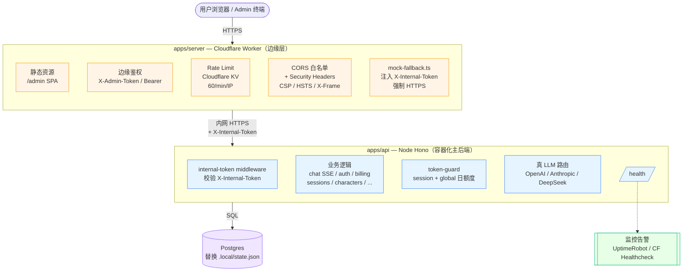

# ADR-0008: 上线形态决策（生产入口走哪条）

- **状态**: Accepted
- **日期**: 2026-05-14
- **决策者**: 架构 + PM
- **决策**: **方案 A** — Worker 当 edge 层，mock-server 当 Node 主后端，靠 ENABLE_MOCK_FALLBACK 串

## 背景

仓库当前并存**两套后端**入口：

| 后端 | 当前状态 |
|---|---|
| `apps/server`（Cloudflare Workers） | 几乎全是 stub；admin 路由完全未鉴权（见 `接口审计与TODO.md §三` P0-A） |
| `apps/mock-server`（Node + Hono） | 真实业务实现，持久化齐全，灰测卫生包已加固（v0.77.514.14） |

生产入口目前事实上是 **Caddy → mock-server**（`infra/deploy/`），`apps/server` 没上线。但仓库里还留着 `apps/server` 全套占位文件，加上 [ADR-0007](0007-linked-server-mock-fallback.md) 的本地联动 fallback，**形态不明**——14 个 stub 不知道删还是留，部署运维（`wrangler.toml`、监控、CI）不知道走哪条线。

S1 决策是灰测窗口期**多个后续任务的共同前置**：BE-131（apps/server 鉴权止血）、S2（14 个 stub 整理）、S4（持久化升级）、S5（部署运维）、F2（上线时接通支付/短信）的排序全部依赖本决策。

## 选项

### 方案 A：Worker 当 edge + mock-server 当 Node 主后端（推荐）

- `apps/server` 保留为 Cloudflare Workers edge 层，只做：
  - 静态资源 / `/admin` SPA
  - `/api/*` 经 `mock-fallback.ts` 透传到 `apps/mock-server`（Node 进程）
  - 边缘鉴权 / rate-limit / CORS
- `apps/mock-server` 容器化部署成主后端（已有 Caddy + docker compose）
- `ENABLE_MOCK_FALLBACK=true` + `MOCK_SERVER_BASE=https://...` 正式化为生产配置

**好处**：
- 复用当前所有可工作的代码，不重写
- 业务逻辑只一份，避免双轨维护
- 现在的 mock-server 已经通过灰测卫生包加固

**代价**：
- 仓库名"mock-server"语义错位（实际是生产后端），可改名 `apps/api`
- 必须给 fallback 加生产级守门（防止误开发环境暴露）

### 方案 B：Worker 内实装业务（接 D1 / Hyperdrive + Postgres）

- 把 `apps/mock-server` 的所有逻辑往 Workers 搬
- 接 Cloudflare D1 或 Hyperdrive + 外部 Postgres

**好处**：
- 完全 serverless，无 Node 进程
- 边缘性能 + 自动扩缩

**代价**：
- 几乎从零重写后端（56 个 TODO 不是占位，是真没写）
- D1 / Hyperdrive 的能力上限和 mock-server 当前用法（JSON 文件、Map、in-memory SSE）冲突
- 灰测进度严重延期

### 方案 C：弃用 `apps/server`，mock-server 直接当生产

- 删除 `apps/server` 整个 workspace（含 ADR-0007 撤销）
- mock-server 直接对接 Caddy，rename 为 `apps/api`
- 边缘能力（rate-limit / CORS / CDN）依赖 Caddy + 反向代理

**好处**：
- 仓库结构最干净
- 没有"双轨"困惑

**代价**：
- 失去 Workers 全球边缘的潜在好处（如果以后真需要）
- 撤销 ADR-0007，已经做的 mock-fallback 工作作废

## 决策

**选定方案 A**。生产入口形态：

```
互联网
  ↓
Cloudflare Worker (apps/server，edge 层)
  ├── 静态资源 / /admin SPA
  ├── 边缘鉴权（admin token / user token 验签）
  ├── rate-limit（Upstash 或 Cloudflare KV）
  ├── CORS 白名单 + security headers (CSP / HSTS)
  └── /api/* → mock-fallback.ts → MOCK_SERVER_BASE (HTTPS)
  ↓
Node 主后端 (apps/api，容器化部署，前身 apps/mock-server)
  ├── 业务逻辑（全部已实装，灰测卫生包加固）
  ├── Postgres 持久化（替换 .local/state.json）
  ├── 真 LLM 调用 + token-guard
  ├── 结构化日志 + requestId
  └── /health
```

### 顶层架构图（DOC-102）



**关键边界**：
- 用户 ↔ Edge：公网 HTTPS，受 CORS / Rate Limit / Security Headers 保护
- Edge ↔ Backend：内网 HTTPS + `X-Internal-Token` 互验（[ADR-0009](0009-internal-token-design.md)），Backend 拒绝任何未签名直连
- Backend ↔ DB：内网，连接串走 `.env`，凭证按 ADR-0010（待）
- Backend → 监控：仅 `/health` 暴露给外部探活（不走 token，避免误报）

理由：

1. 当前可工作的代码全在 mock-server，灰测卫生包（v0.77.514.14）已经把它加固到生产水位线，复用成本最低
2. ADR-0007 已经建立 fallback 桥，从"本地联动"升级为"生产配置"是 1 行 env 改动
3. 复用 Caddy + Docker Compose 现有部署（[`infra/deploy/`](../../../infra/deploy/)），不需要从零搭
4. Worker 在 edge 上做鉴权 + rate-limit + CORS，把这些不应分散到业务代码的关注点收敛到一处
5. 即使将来想往 B 方向走（业务搬进 Workers + D1），A 是 B 的合法中间态

## 后果

### 直接锁定的后续工作（按层级）

**边缘层 `apps/server`**（Cloudflare Worker）：
- **BE-131**：admin 路由加 `requireAdmin`（5 min 止血）
- **BE-134**：14 个业务 stub 全部替换为 `return c.json({ code:'BACKEND_UNAVAILABLE' }, 503)` 让 fallback 接管（或直接删除文件让 Hono not-found 走 fallback）
- **BE-135**：mock-fallback 加生产级守门（`MOCK_SERVER_BASE` 必须 HTTPS、出向请求带边缘签的内部 token）
- **BE-136**：rate-limit 接 Upstash Redis 或 Cloudflare KV
- **BE-137**：CORS 白名单化（删 `*`）
- **BE-138**：security headers（CSP / HSTS / X-Frame-Options / X-Content-Type-Options）
- **INFRA-104**：`wrangler.toml` 生产环境变量（`MOCK_SERVER_BASE`、`ADMIN_TOKEN`、`INTERNAL_TOKEN`）
- **INFRA-107**：Cloudflare Workers secrets 管理 SOP

**Node 主后端 `apps/api`**（前身 mock-server）：
- **BE-139**：改名 `apps/mock-server` → `apps/api`（包名、目录、脚本、文档全改；可独立排期）
- **BE-140**：Postgres 接入（替换 `store/persistence.ts`，复用 `infra/db/` 迁移工具）
- **BE-141**：`state.json` → Postgres 迁移脚本（一次性）
- **BE-142**：接受边缘签内部 token（与 BE-135 对端，拒绝直暴）

**运维 / CI**：
- **INFRA-105**：Docker 生产 compose（含 Postgres 容器或 managed PG 接入）
- **INFRA-106**：CI pipeline（GitHub Actions：typecheck + `verify:gray` + 构建 docker image + 发布 Worker）
- **INFRA-108**：`/health` 接监控告警（UptimeRobot / Cloudflare Healthcheck）

**测试**：
- **TEST-107**：边缘层测试（fallback 守门、内部 token 验签、rate-limit）
- **TEST-108**：F3 高频路由单测（chat SSE / auth / events）
- **TEST-109**：e2e 注册→选角→对话→消费

**文档**：
- **DOC-104**：生产部署 runbook（`infra/deploy/PRODUCTION.md`）
- 更新 [ADR-0007](0007-linked-server-mock-fallback.md) 标注与本 ADR 的关系（fallback 从"本地联动"升级"生产配置"）
- 更新 [接口审计与TODO.md](../../../接口审计与TODO.md) §一 架构表反映新形态

**保留为 stub 不动**（上线前 1-2 周才接，已在 `接口审计与TODO.md §五 F2` 列出）：
- 短信 OTP、微信支付/支付宝/Stripe webhook 验签

### 形态变化的硬性后果

- `apps/server` 不再"暂缓 Phase 1 W5+"，**升级为 edge 层一等公民**；DEFER-002 状态需重定义
- `apps/mock-server` 不再是 mock，**改名 `apps/api` 消除语义错位**（BE-139）
- `.local/state.json` 仅作开发态，**生产必须 Postgres**（BE-140/141）
- `ENABLE_MOCK_FALLBACK=true` **正式成为生产配置**，不再是"防误开"的危险开关；但 `MOCK_SERVER_BASE` 必须 HTTPS + 内部 token 守门

## 相关

- [ADR-0007](0007-linked-server-mock-fallback.md)：本地联动 fallback（本 ADR 决定它能不能正式化）
- [接口审计与TODO.md](../../../接口审计与TODO.md) §五 S1：决策背景与影响范围
- [docs/TODOlist.md](../../TODOlist.md) DEFER-002 / BE-131：依赖本决策的任务
